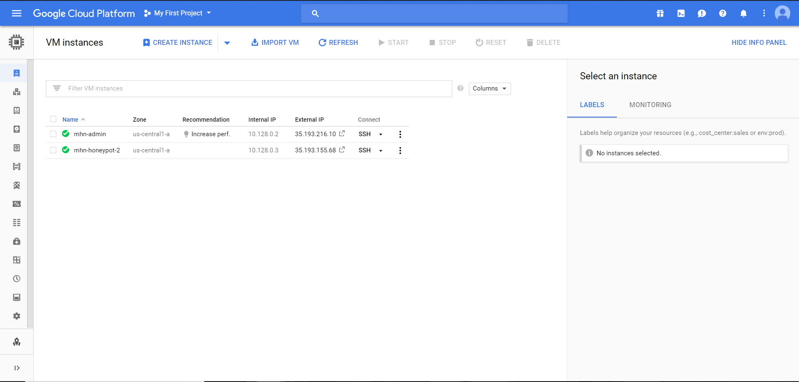

# CyberSecurity-Week-9

During this week I did not get the chance to actually deploy the honey pots. I got through all of the set up, however google required me to varify my payment metod with photos of my id and the credit card. I managed to make a few honey pots however they did not actually contain anything in them due to the request timing out. The following contains screen shots of what I managed to get working and some of the honey pots I might have tried out if i was able to get them working.

I did not manage to get any data due to the fact that the requests kept timing out. The only other issue I had with this assignment was the firewall issue that i quickly resolved.
